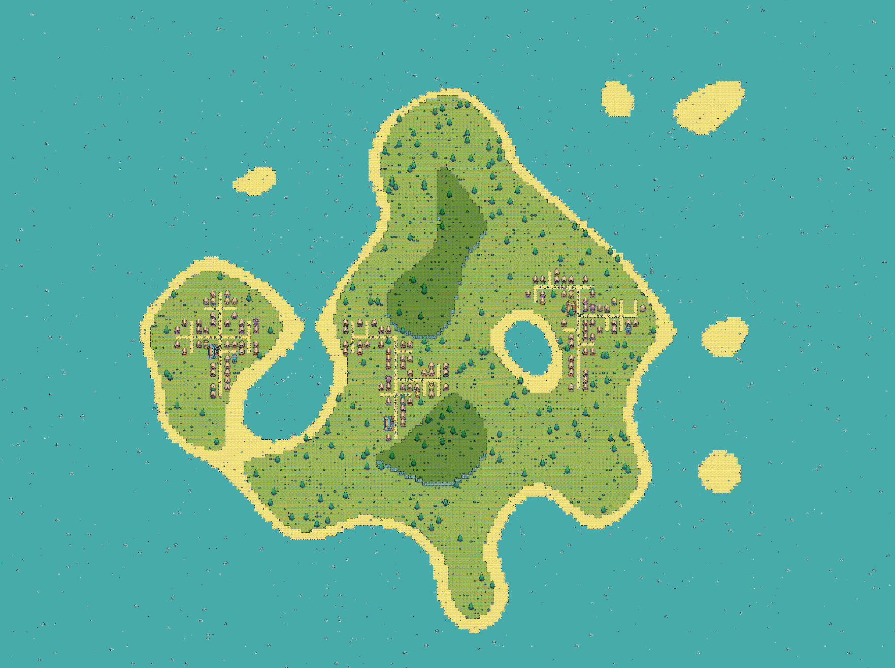
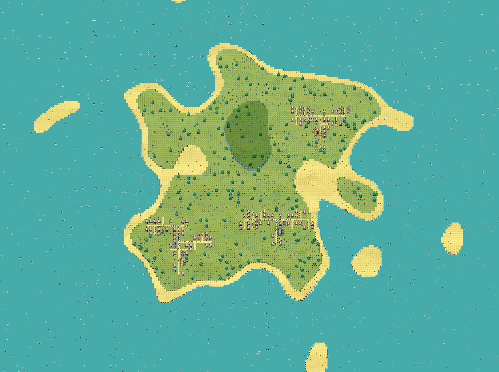

# Medieval Markets
The game is a top-down, 2d, tile-based game set during the medieval ages on an island where you are a new merchant ready to earn riches. Your goal is to sell resources to the townsfolk and manage the supply and demand that comes with creating a market.

## Procedural Map Generation

#### Perlin Noise
- Used Perlin Noise crossed with a circular gradient to procedurally generate the terrain of an island

#### Lindenmayer Systems
- Procedural town paths were generated by Lindenmayer Systems, systems programmed specifically so roads do not overlap

#### Recursive Placement
- Building plots for castles, towers, and houses were created through recursive functions crawling through town path

#### Weighted Randomizer
- All shrubbery and rocks placed on weighted randomizer, weights based on distance from shore

## NPC Behavior

#### Depth First Search Movement
- Movement from buildings use nodes and depth first search, only possible due to town paths not overlapping from Lindenmayer Systems

#### Needs
- NPC have 3 needs: food, wood, and gold. Each has a bar counter that slowly depreciates overtime.

#### Classes
- NPC also have 3 classes: upper, middle, and lower class. Each class is connected to a need; upper class depreciates gold faster, middle class depreciates wood faster, and lower class depreciates food faster.

## Buildings

#### Markets
- There is a level 1, 2, and 3 market where each increases in selling distance and storage. NPC come here to get their resources.
#### Production
- There is a gold mine, tree farm, and pumpkin farm that creates resources to transport to markets.

## Build Mode

This mode highlights the building and dims the rest of the map. Raycasts are used to check if placement is avaliable.

## Connection Mode

This mode connects production buildings to markets using the Line renderer to drag onto buildings.